

  
  

  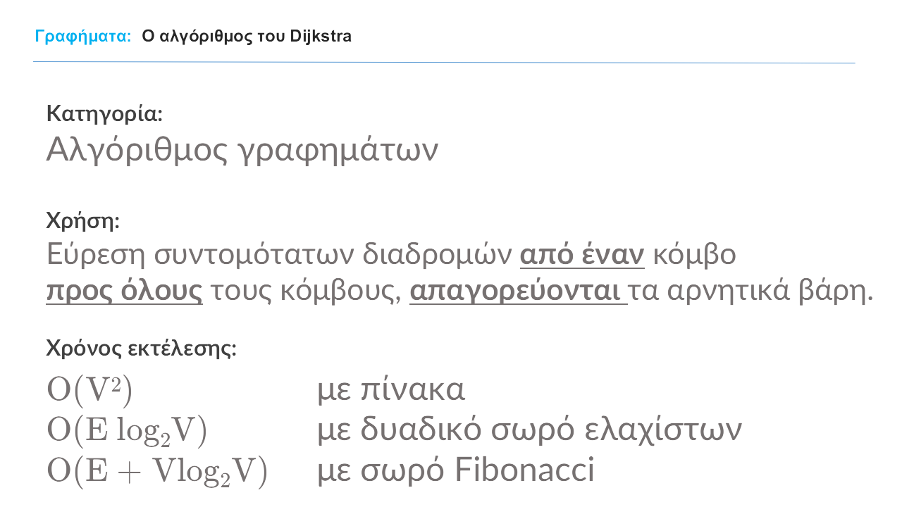
   
  
Ο αλγόριθμος του Dijkstra είναι αλγόριθμος γραφημάτων και χρησιμοποιείται, σε κατευθυνόμενα - εμβαρή γραφήματα για την εύρεση συντομότατων διαδρομών από έναν κόμβο προς όλους τους άλλους κόμβους ενός γραφήματος. Στον αλγόριθμο του Dijkstra απαγορεύονται οι ακμές με αρνητικά βάρη. Ο χρόνος εκτέλεσής του ποικίλει, ανάλογα με τον τύπο δεδομένων που θα χρησιμοποιήσουμε στην υλοποίηση του αλγορίθμου.

  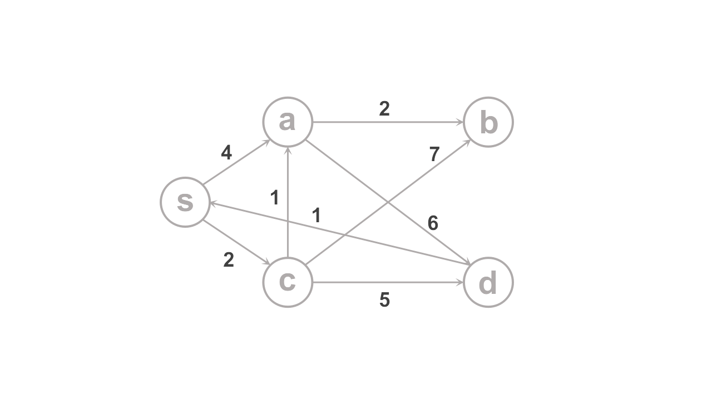
   
  
Ας τρέξουμε τον αλγόριθμο σε αυτό το γράφημα.

  

  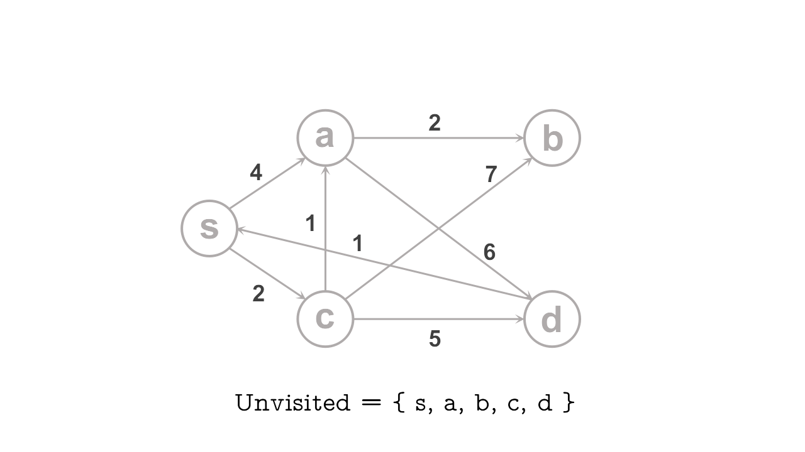
   
  
Αρχικά δημιουργούμε μία λίστα που περιέχει όλους τους μη εντοπισμένους κόμβους του γραφήματος μας. Επόμενο βήμα είναι να διαλέξουμε τον αρχικό κόμβο. Στο παράδειγμά μας, επιλέγουμε ως αρχικό κόμβο τον <strong><em>s</em></strong>.

  

  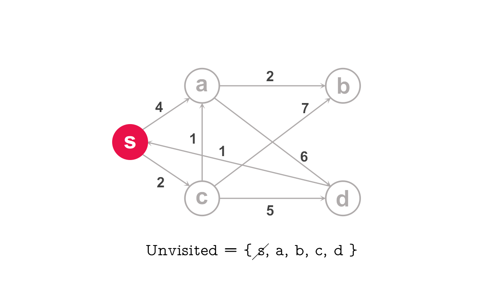
   
  
Διαγράφουμε τον <strong><em>s</em></strong> από την λίστα των μη εντοπισμένων κόμβων.

  

  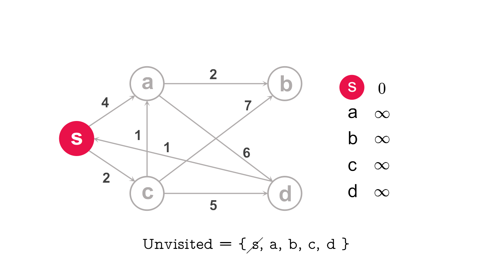
   
  
Έπειτα, δημιουργούμε έναν πίνακα που θα περιέχει την απόσταση κάθε κόμβου από τον αρχικό κόμβο <strong><em>s</em></strong>. Βάζουμε την τιμή 0 στον αρχικό κόμβο <strong><em>s</em></strong>, αφού απαιτείται μηδενικό κόστος για να πάμε από τον <strong><em>s</em></strong> στον εαυτό του, και άπειρο για όλους τους άλλους κόμβους, μιας και δεν είναι ακόμη προσπελάσιμοι από αυτόν.

  

  
   
  
Ξεκινάμε να ελέγχουμε κάθε ακμή που εξέρχεται από τον <strong><em>s</em></strong>. Για κάθε τέτοια ακμή ελέγχουμε αν το κόστος του <strong><em>s</em></strong> συν το βάρος της ακμής, είναι μικρότερο από το κόστος του κόμβο που συνδέεται η ακμή και ανανεώνουμε τον πίνακά μας κατάλληλα. Η διαδικασία αυτή ονομάζεται πράξη χαλάρωσης. Μπορούμε να πάμε στους κόμβους <strong><em>a</em></strong> και <strong><em>b</em></strong>, με κόστος 4 και 2 αντίστοιχα. Και τα δύο κόστη είναι μικρότερα του απείρου, οπότε ας ανανεώσουμε τις τιμές του πίνακά μας.

  

  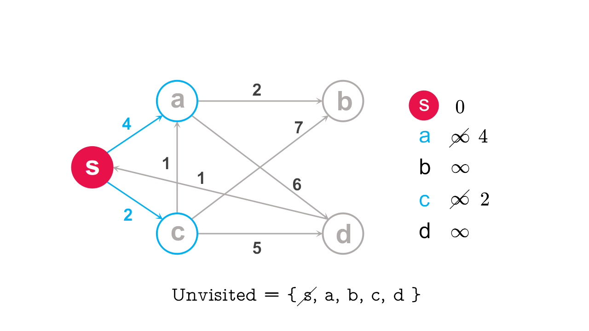
   
  

  

  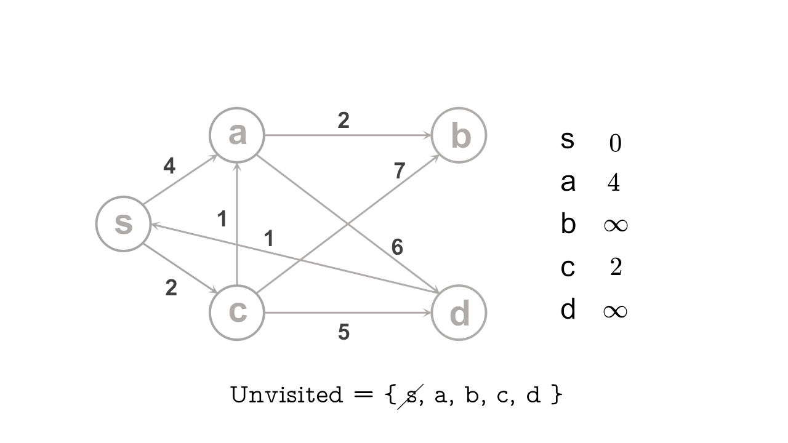
   
  
Σε αυτό το σημείο διαλέγουμε τον κόμβο που έχει το μικρότερο κόστος και περιέχεται στην λίστα με τους μη εντοπισμένους κόμβους.

  

  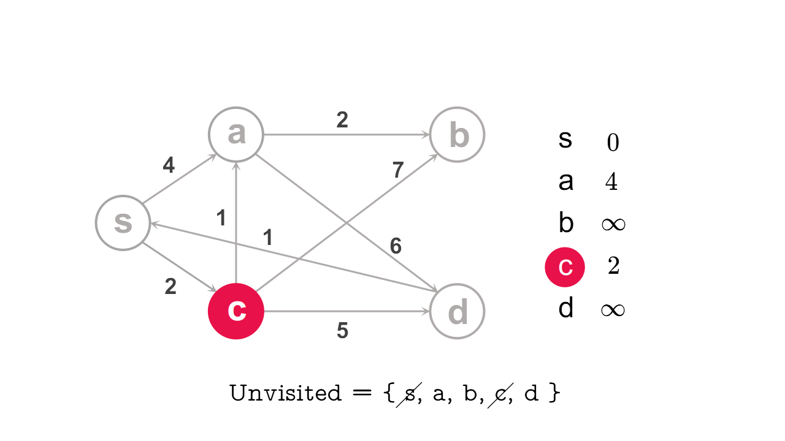
   
  
Αυτός ο κόμβος είναι ο <strong><em>c</em></strong>. Διαγράφουμε τον <strong><em>c</em></strong> από την λίστα και κοιτάζουμε πάλι τις εξερχόμενες ακμές του.

  

  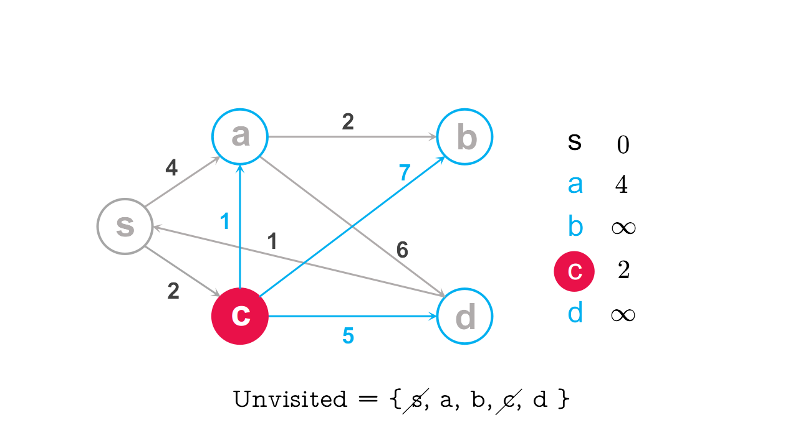
   
  
Ακολουθώντας την ίδια διαδικασία χαλάρωσης παρατηρούμε ότι για να πάμε από τον <strong><em>c</em></strong> στον <strong><em>a</em></strong> το συνολικό κόστος είναι 2 συν 1, 3 που είναι μικρότερο από το ήδη υπάρχον κόστος του <strong><em>a</em></strong> που είναι 4. Σε αυτή την περίπτωση ανανεώνουμε το κόστος του <strong><em>a</em></strong> με το νέο μικρότερο κόστος που είναι το 3.

  

  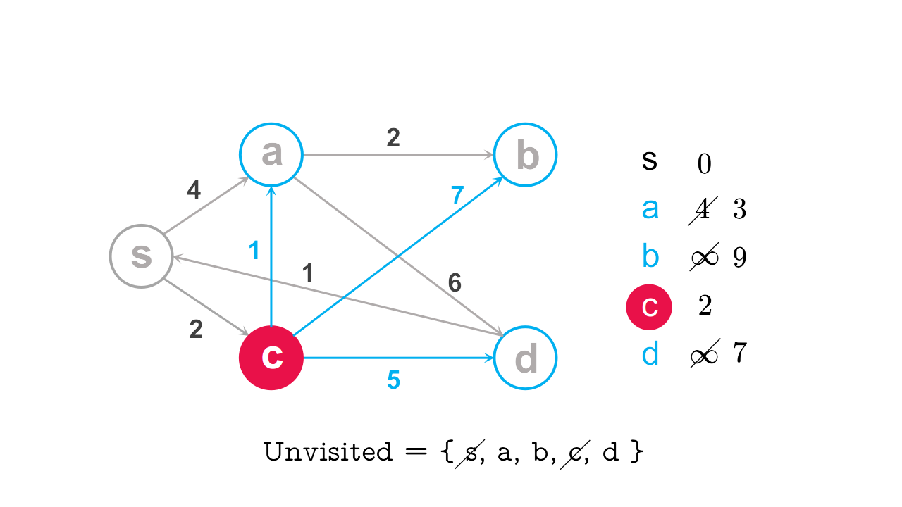
   
  
Το ίδιο κάνουμε και για τους κόμβους <strong><em>b</em></strong> και <strong><em>d</em></strong>. Πλέον το κόστος του <strong><em>b</em></strong> είναι 9, αφού 2 που είναι το κόστος του <strong><em>c</em></strong> συν το 7 που είναι το βάρος της ακμής που συνδέει τον <strong><em>c</em></strong> με τον <strong><em>b</em></strong> ισούται με 9. και το νέο κόστος του <strong><em>d</em></strong> ισούται με 7.

  

  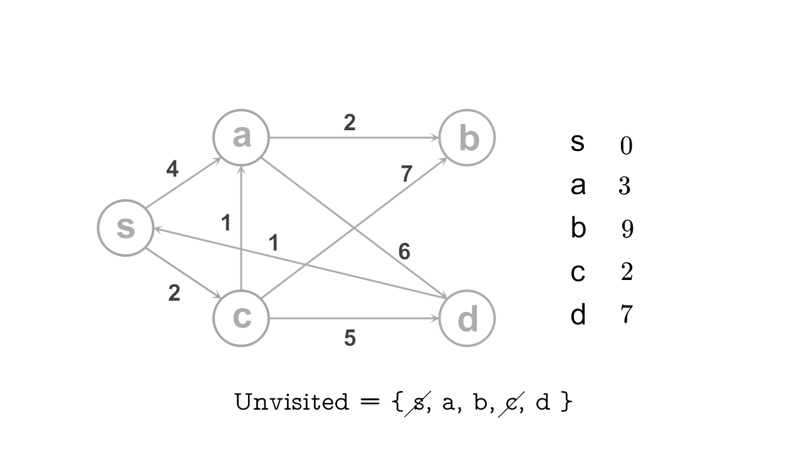
   
  
Αφού ολοκληρώσαμε και με τον κόμβο <strong><em>c</em></strong>, επιλέγουμε όπως και πριν τον κόμβο που έχει το μικρότερο κόστος και περιέχεται στην λίστα με τους μη εντοπισμένους κόμβους. Αυτός ο κόμβος είναι ο <strong><em>a</em></strong>.

  

  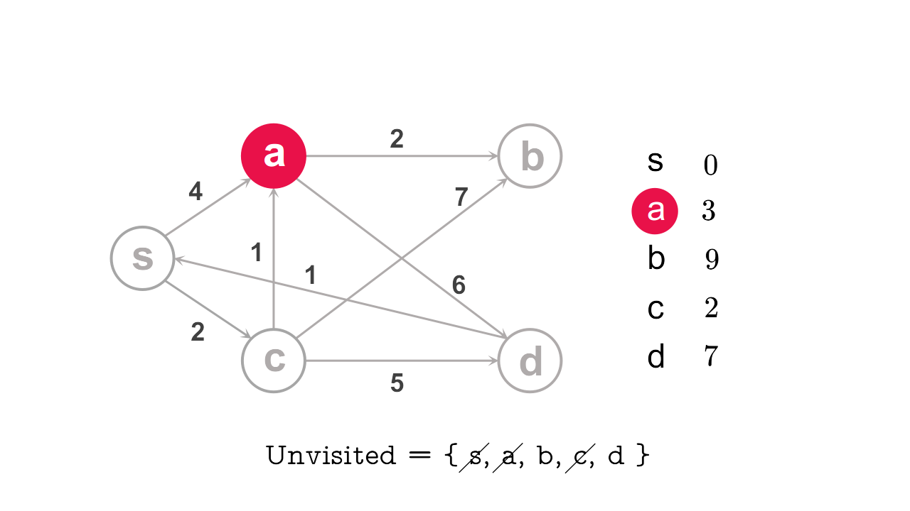
   
  
Διαγράφουμε τον κόμβο <strong><em>a</em></strong> και κοιτάμε τις εξερχόμενες ακμές του.

  

  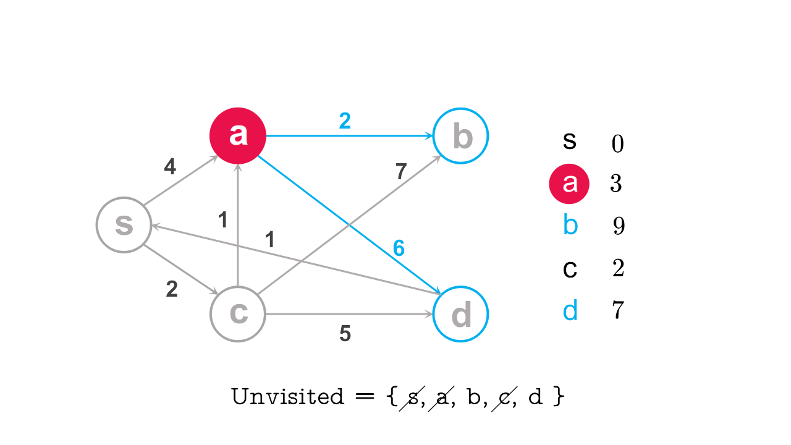
   
  
Μπορούμε να επισκεφτούμε τον κόμβο <strong><em>b</em></strong> με κόστος 5 και τον <strong><em>d</em></strong> με κόστος 9. Όμως θα ανανεώσουμε μόνο τον κόμβο <strong><em>b</em></strong> αφού το νέο κόστος του <strong><em>d</em></strong> δεν είναι μικρότερο του 7.

  

  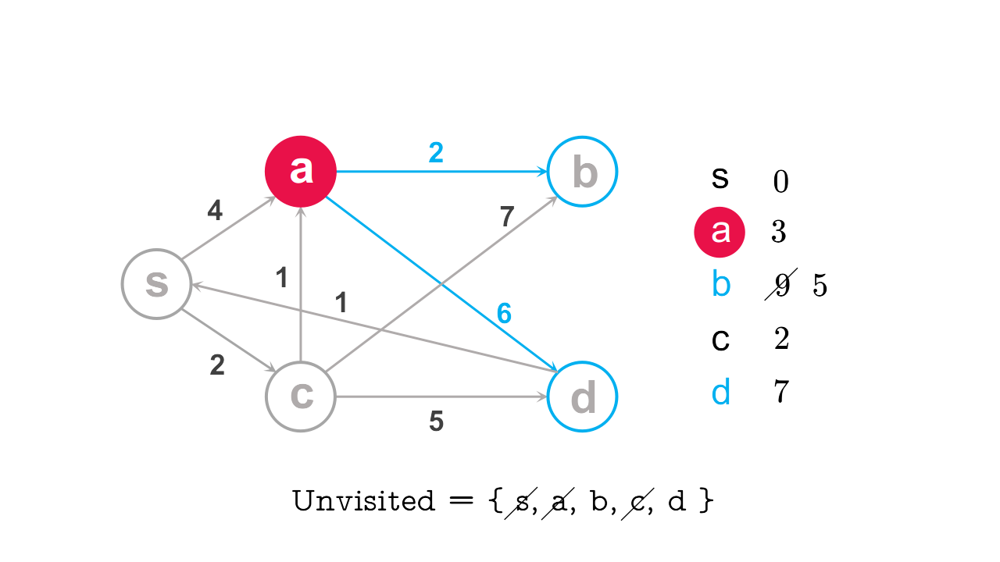
   
  

  

  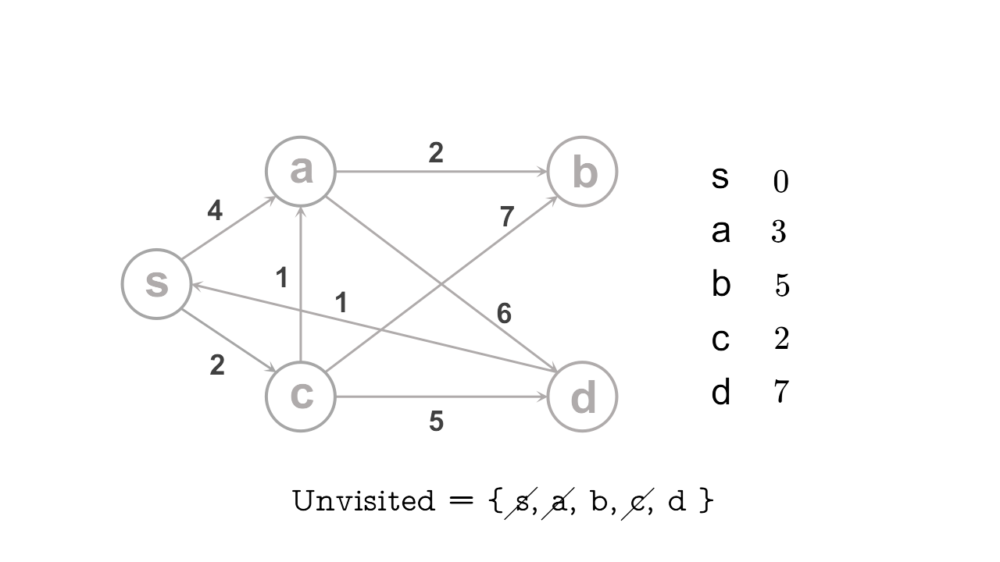
   
  
Επόμενος κόμβος που επιλέγουμε είναι ο <strong><em>b</em></strong>.

  

  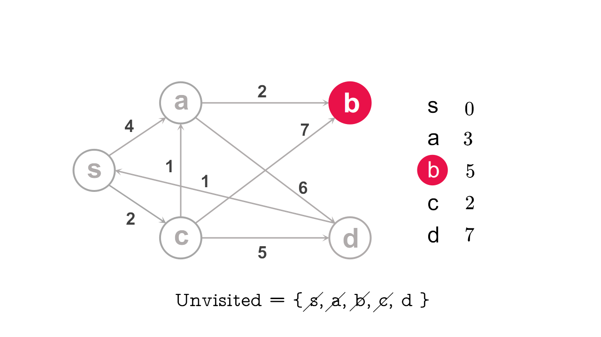
   
  
Ο <strong><em>b</em></strong> δεν περιέχει εξερχόμενες ακμές.

  

  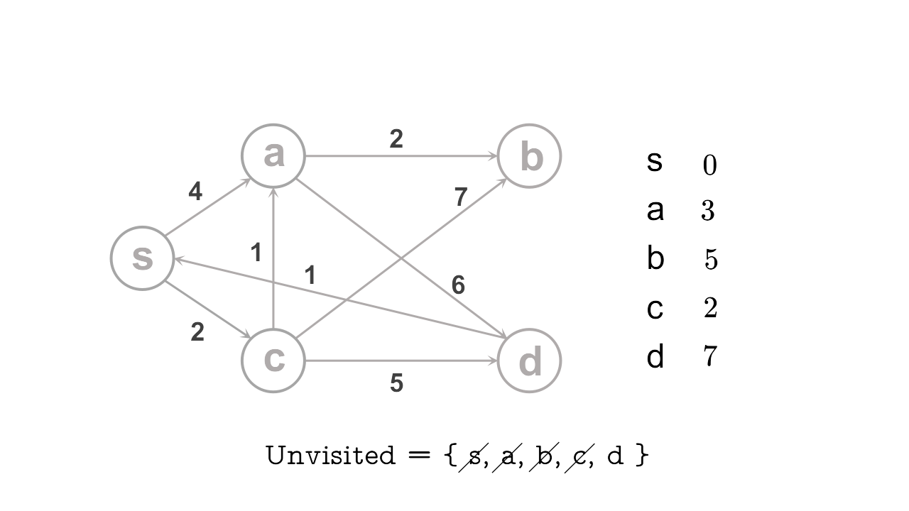
   
  
Ο τελευταίος κόμβος που θα εξετάσουμε είναι ο <strong><em>d</em></strong>.

  

  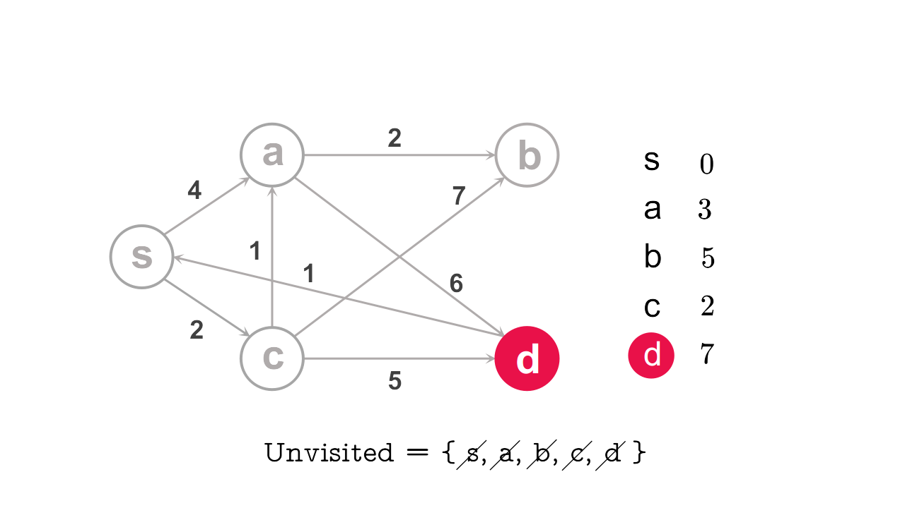
   
  
Παρατηρούμε την ύπαρξη μίας εξερχόμενες ακμής που συνδέει τον <strong><em>d</em></strong> με τον <strong><em>s</em></strong>.

  

  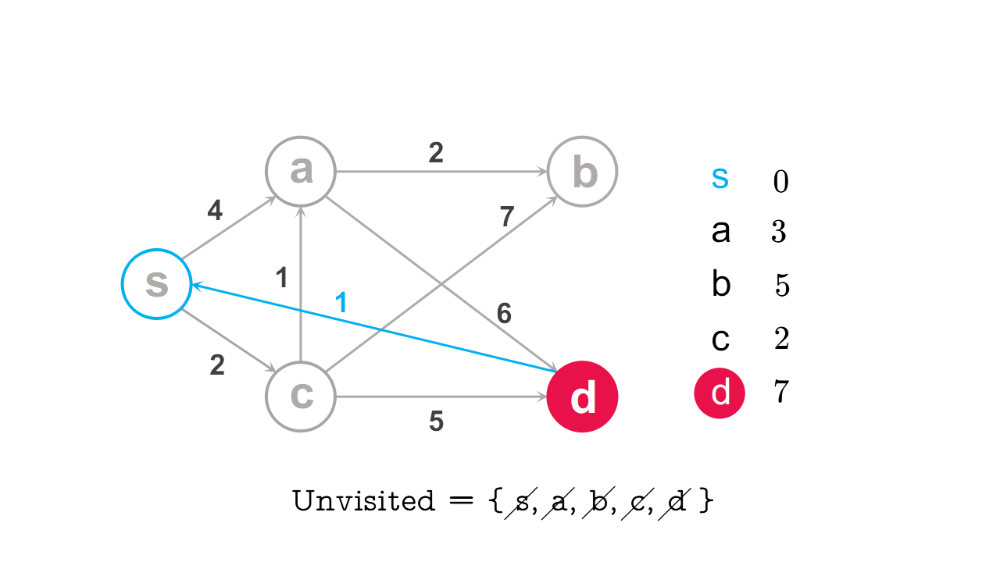
   
  
Το κόστος του <strong><em>d</em></strong> συν το βάρος της ακμής είναι 8, όμως δεν είναι μικρότερο από το κόστος του <strong><em>s</em></strong> οπότε δεν ανανεώνουμε τον πίνακα με τα κόστη μας ούτε σε αυτή την επανάληψη.

  

  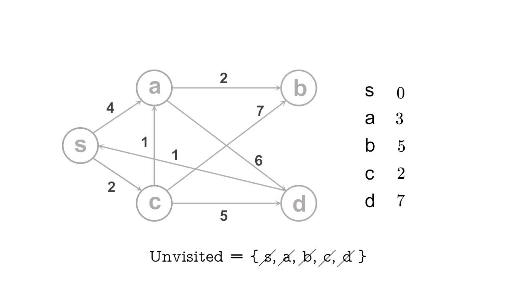
   
  
Έχουμε πλέον επισκεφτεί όλους τους κόμβους.

  

  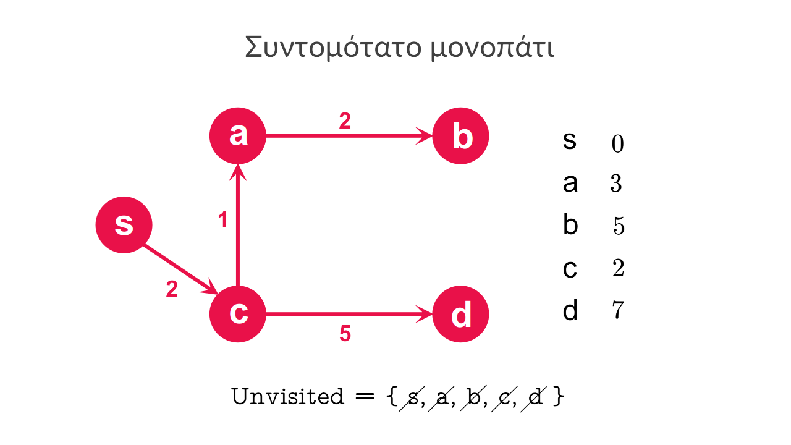
   
  
Το γράφημα που προκύπτει περιέχει τις συντομότατες διαδρομές από το τον αρχικό κόμβος <strong><em>s</em></strong> προς κάθε άλλον κόμβο.

  

  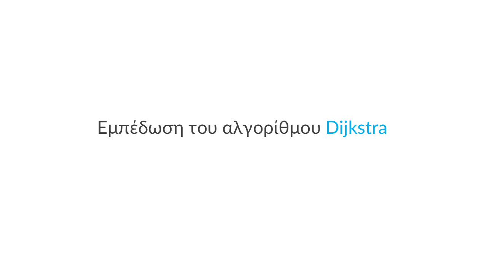
   
  

  

  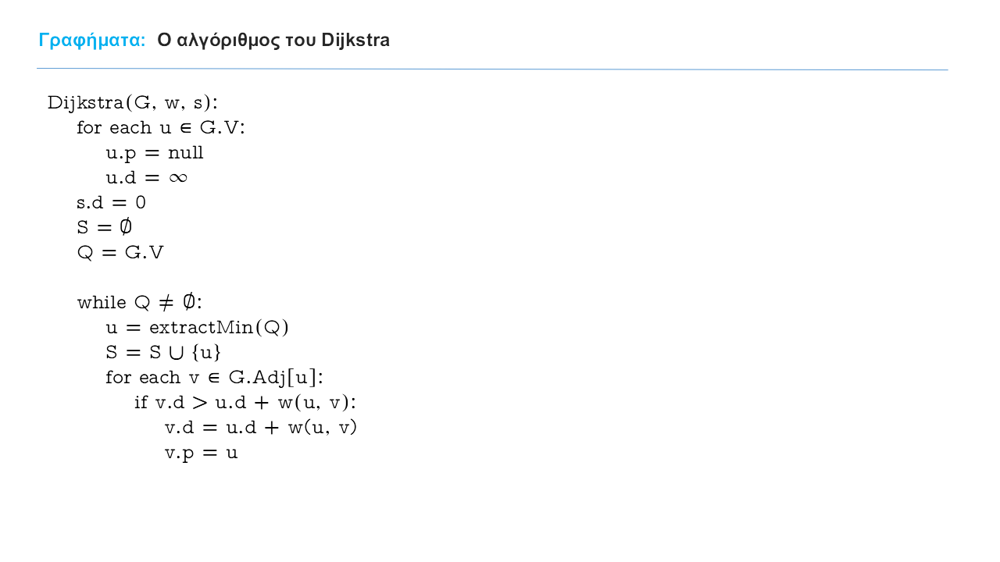
   
  
Αυτός είναι ο αλγόριθμος σε μορφή ψευδοκώδικα. Αρχικά, παρατηρούμε ότι ο αλγόριθμος δέχεται τρεις παραμέτρους. Το γράφημα <strong><em>G</em></strong> στο οποίο θα εφαρμοστεί, μία συνάρτηση <strong><em>w</em></strong> που αντιστοιχεί βάρη σε ακμές και τον αρχικό κόμβο <strong><em>s</em></strong>.

  

  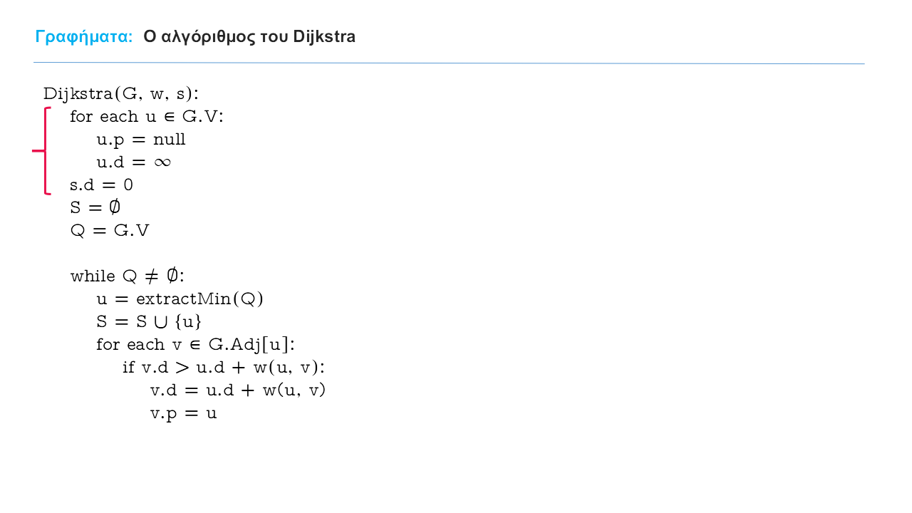
   
  
Η εκτέλεση του αλγορίθμου ξεκινάει με την απόδοση αρχικών τιμών. Το πεδίο <strong><em>p</em></strong> δείχνει τον πατρικό ενός κόμβου. Το πεδίο <strong><em>d</em></strong> χρησιμοποιείται για να αποθηκεύσουμε την απόσταση του εκάστοτε κόμβου από τον αρχικό μας.

  

  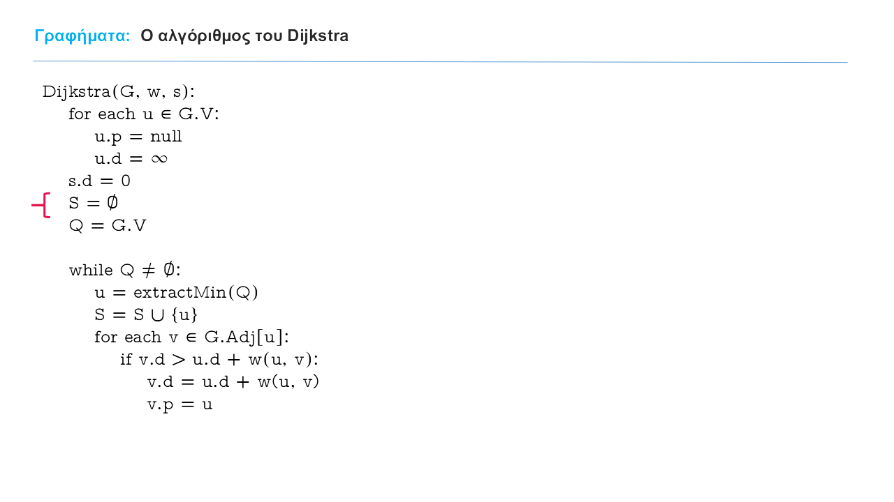
   
  
Ακολουθεί η δημιουργία του συνόλου <strong><em>S</em></strong>. Στο τέλος του αλγορίθμου το σύνολο <strong><em>S</em></strong> θα περιέχει όλους τους κόμβους του αρχικού γραφήματος <strong><em>G</em></strong>.

  

  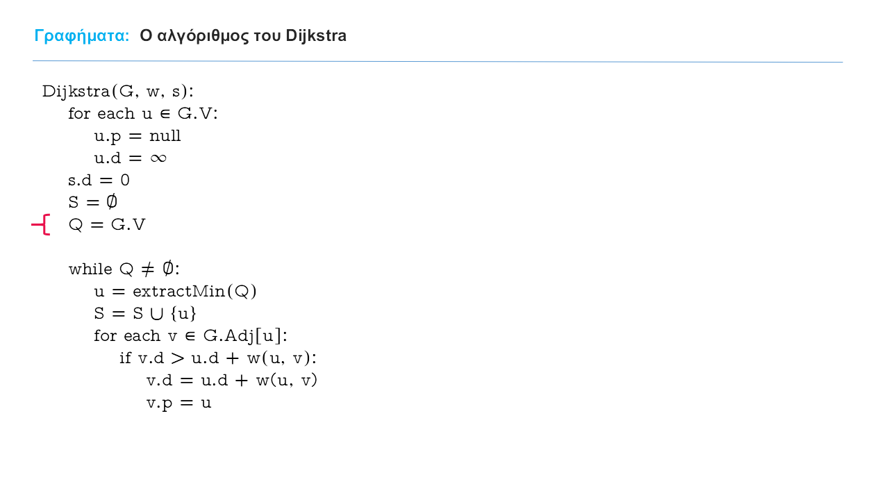
   
  
Επόμενο βήμα είναι η δημιουργία της ουράς προτεραιότητας ελαχίστων. Με αυτό τον τρόπο θα μπορούμε να επιλέγουμε κάθε φορά την ακμή με το ελάχιστο βάρος.

  

  
   
  
Ο αλγόριθμος θα πρέπει να συνδέσει όλους τους κόμβους του γραφήματος. Ο βρόγχος while ελέγχει αν υπάρχουν ακόμα κόμβοι στην ουρά <strong><em>Q</em></strong>.

  

  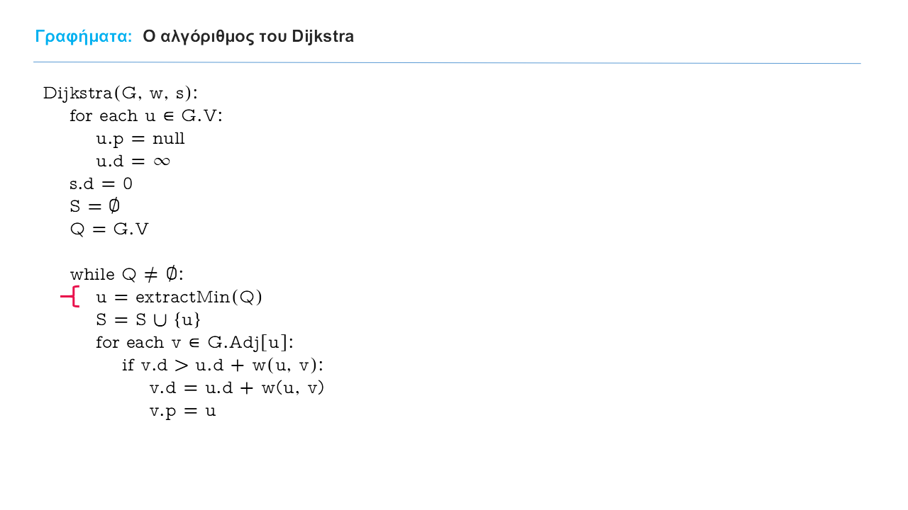
   
  
Σε κάθε επανάληψη του βρόγχου while εξάγουμε τον κόμβο με το μικρότερο κόστος. Αυτός ο τρόπος διασφαλίζει και την περατότητα του βρόγχου while.

  

  
   
  
Προσθέτουμε τον κόμβο <strong><em>u</em></strong> στο σύνολο <strong><em>S</em></strong>.

  

  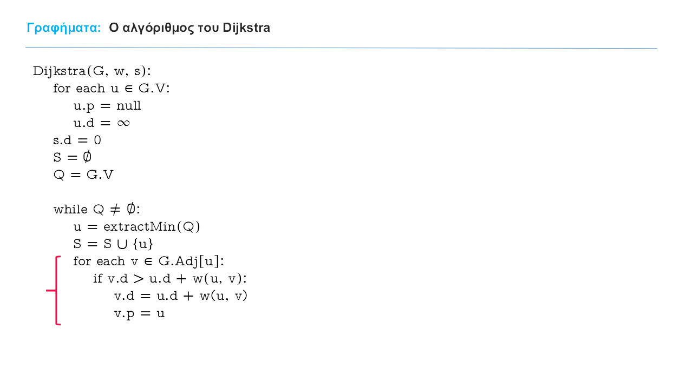
   
  
Για κάθε κόμβο <strong><em>v</em></strong> που συνδέεται με <strong><em>u</em></strong>, ελέγχουμε αν το κόστος του κόμβου <strong><em>v</em></strong> είναι μεγαλύτερο από το βάρος της ακμής που συνδέει τον <strong><em>u</em></strong> με τον <strong><em>v</em></strong> συν το κόστος του <strong><em>u</em></strong>. Αν ναι τότε ανανεώνουμε το κόστος του <strong><em>d</em></strong> και θέτουμε ως πατρικό του το <strong><em>u</em></strong>. Μέσω των πατρικών κόμβων μπορούμε αργότερα να προσπελάσουμε όλους τους κόμβους.

  

  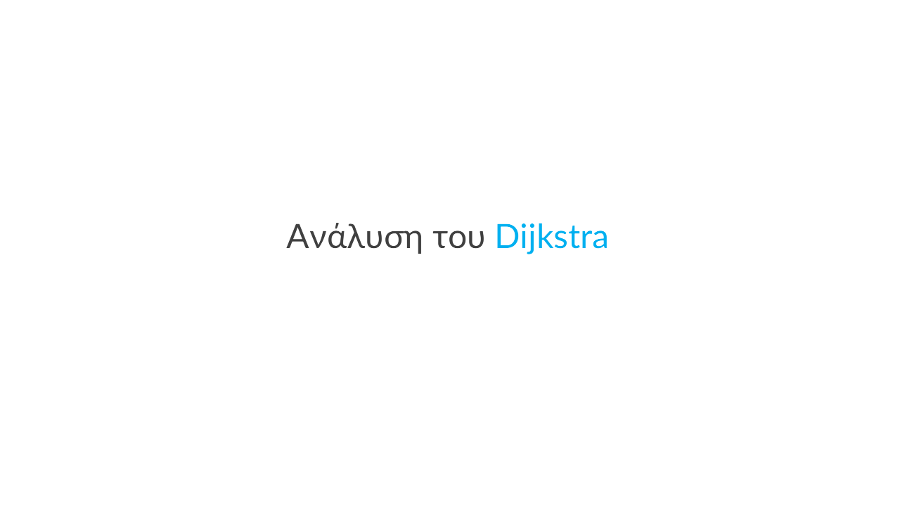
   
  

  

  
   
  

  

  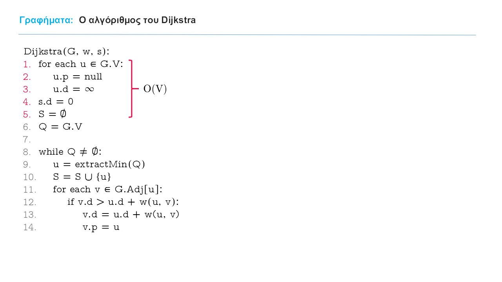
   
  
Οι γραμμές 1 έως 5 έχουμε πολυπλοκότητα <strong><em>O(V)</em></strong> διότι έχουμε έναν επαναληπτικό βρόγχο που εκτελεί τόσες επαναλήψεις, όσες είναι ο αριθμός των κόμβων του γραφήματος. Οι αρχικοποίηση στις γραμμές 4 και 5 εκτελούνται σε σταθερό χρόνο.

  

  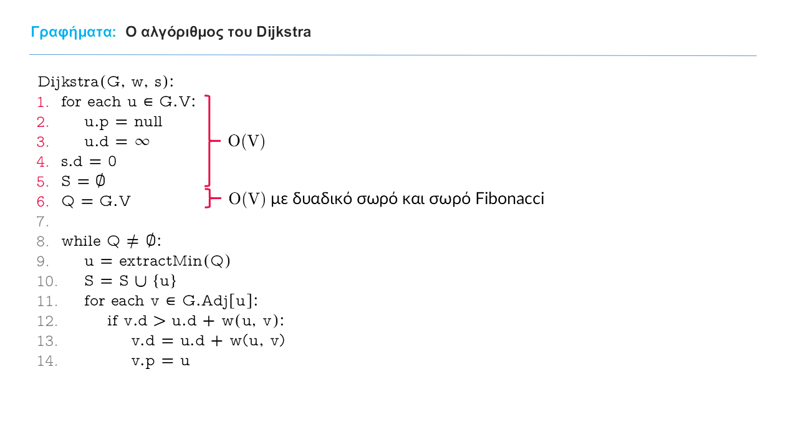
   
  
Για την δημιουργία της ουράς προτεραιότητας ελαχίστων απαιτείτε χρόνος <strong><em>O(V)</em></strong> αν υλοποιηθεί με δυαδικό σωρό ή σωρό Fibonacci.

  

  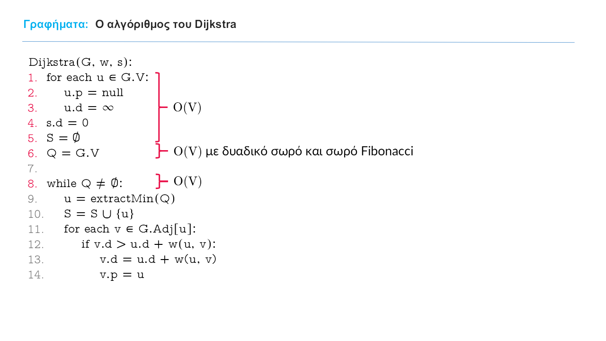
   
  
Η γραμμή 7 θα εκτελεστεί <strong><em>O(V)</em></strong> φορές, όσες δηλαδή το πλήθος των κόμβων του γραφήματος.

  

  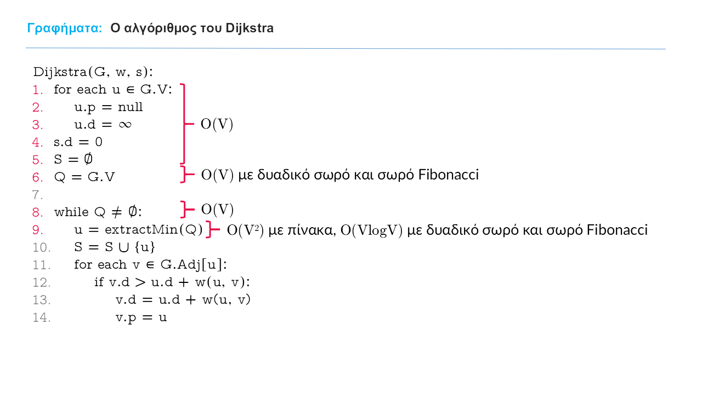
   
  
Η εξαγωγή στοιχείου από την ουρά <strong><em>Q</em></strong> απαιτεί συνολικό χρόνο <strong><em>O(V^2)</em></strong> αν υλοποιηθεί με πίνακα, διαφορετικά <strong><em>O(VlogV)</em></strong> αν υλοποιηθεί με δυαδικό σωρό και σωρό Fibonacci.

  

  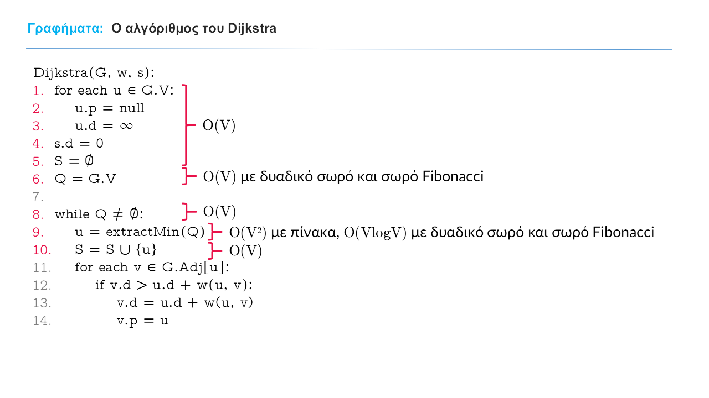
   
  
Η προσθήκη του κόμβου u στο σύνολο <strong><em>S</em></strong> στην γραμμή 10 απαιτεί χρόνο <strong><em>O(V)</em></strong>.

  

  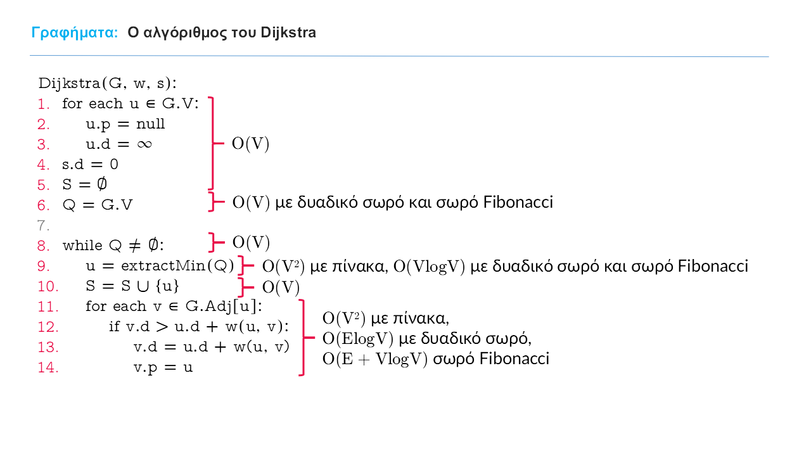
   
  
Οι γραμμές 11 έως 14 θα εκτελεστούν συνολικά <strong><em>O(V^2)</em></strong> αν η υλοποίηση του γραφήματος γίνει με πίνακα γειτνίασης, <strong><em>O(ElogV)</em></strong> αν γίνει με δυαδικό σωρό και <strong><em>O(E + VlogV)</em></strong> αν υλοποιηθεί με σωρό Fibonacci.

  

  
   

