

  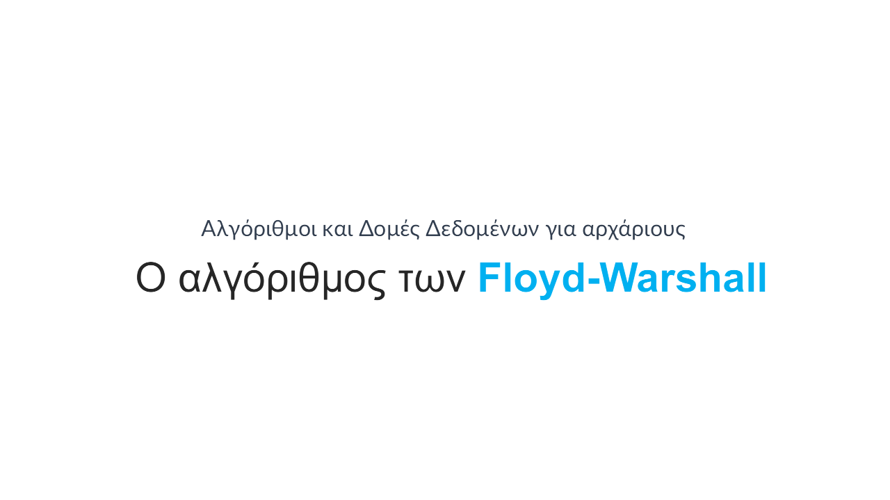
  

  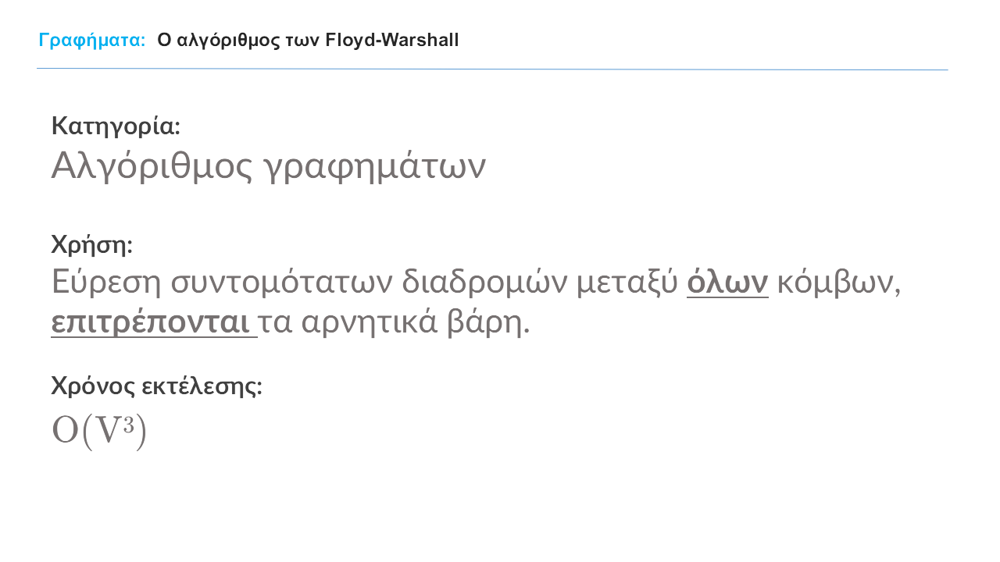
   
  
Ο αλγόριθμος των Floyd-Warshall είναι αλγόριθμος γραφημάτων και χρησιμοποιείται, σε εμβαρή γραφήματα για την εύρεση συντομότατων διαδρομών μεταξύ όλων των κόμβων ενός γραφήματος. Στον αλγόριθμο των Floyd-Wrashall επιτρέπονται οι ακμές με αρνητικά βάρη. Ο χρόνος εκτέλεσής του είναι <strong><em>O(V^3)</em></strong>.

  

  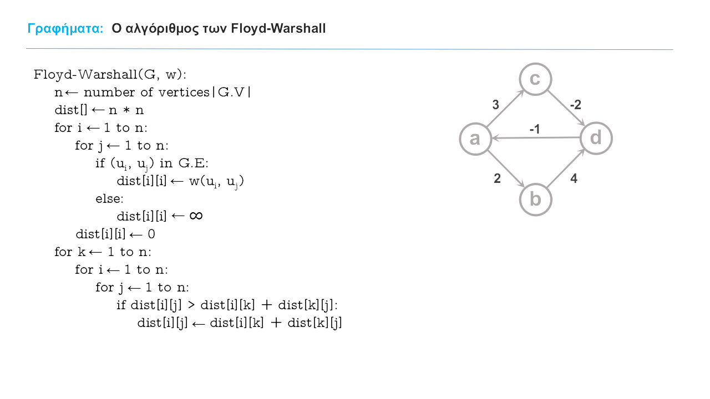
   
  
O αλγόριθμος των Floyd-Warshall είναι απ'τους πιο εύκολα υλοποιήσιμους αλγορίθμους γραφημάτων. Γι' αυτό τον λόγο παραθέτω τον ψευδοκώδικα στα αριστερά της οθόνης.  Μην βιαστείτε ακόμη να βγάλετε συμπεράσματα κοιτώντας μόνο το μέγεθός του. Η ανάλυσή του είναι απλή.

  

  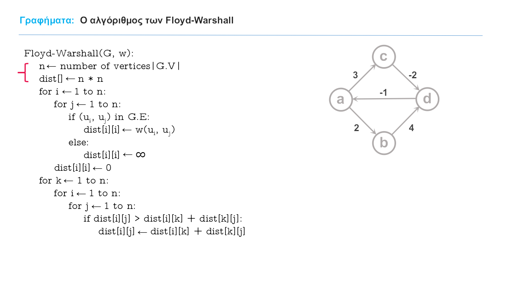
   
  
Αρχικά χρειαζόμαστε ένα γράφημα. Θα χρησιμοποιήσουμε αυτό που υπάρχει ήδη στην οθόνη μας. Παρατηρούμε ότι στο συγκεκριμένο γράφημα περιέχονται τέσσερις κόμβοι. Με βάση αυτό το νούμερο θα δημιουργήσουμε έναν πίνακα γειτνίασης μεγέθους <strong><em>4x4</em></strong> που θα περιέχει τις αποστάσεις μεταξύ όλων των κόμβων του γραφήματος μας.

  

  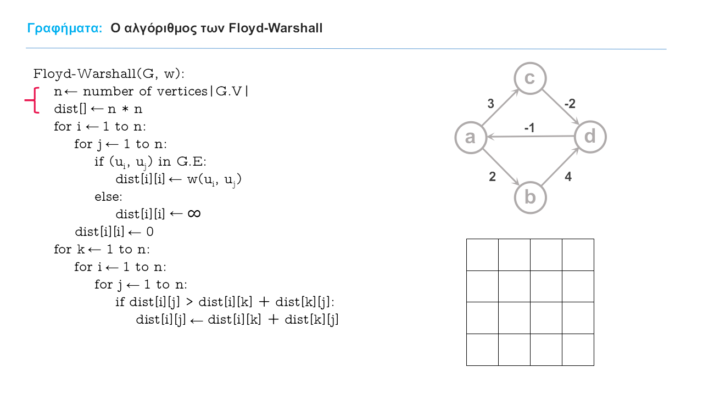
   
  
Πριν συνεχίσουμε ας αντιστοιχήσουμε αυθαίρετα κάθε δείκτη του πίνακά μας σε έναν διαφορετικό κόμβο.

  

  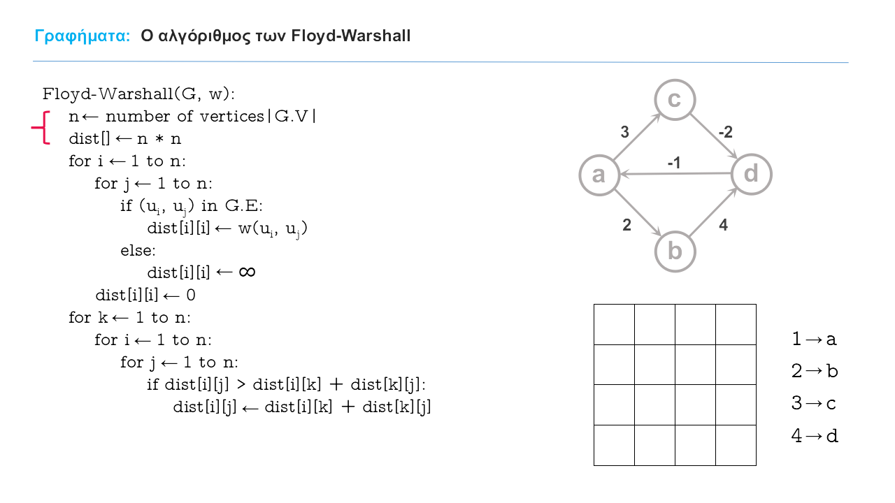
   
  
Ας θεωρήσουμε ότι ο δείκτης 1 αντιστοιχεί στον κόμβο <strong><em>a</em></strong>, ο 2 στον <strong><em>b</em></strong>, ο 3 στον <strong><em>c</em></strong> και ο 4 στον <strong><em>d</em></strong>.

  

  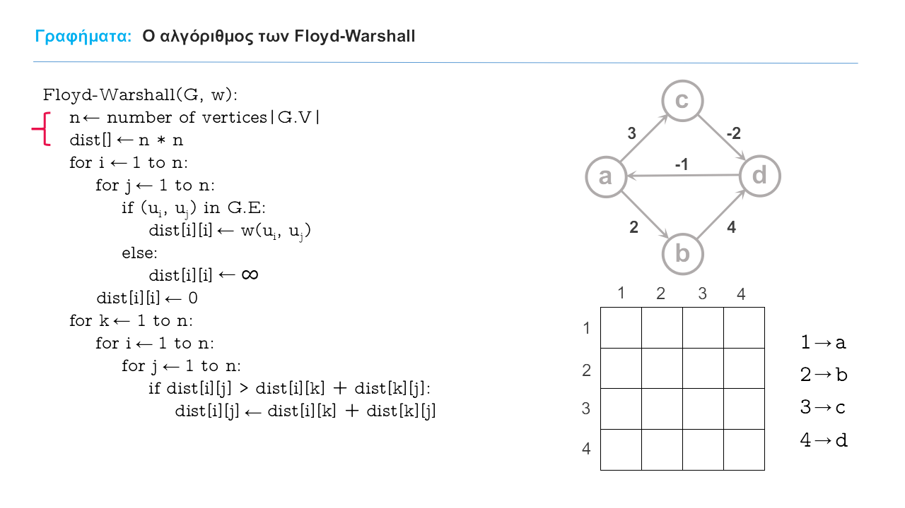
   
  

  

  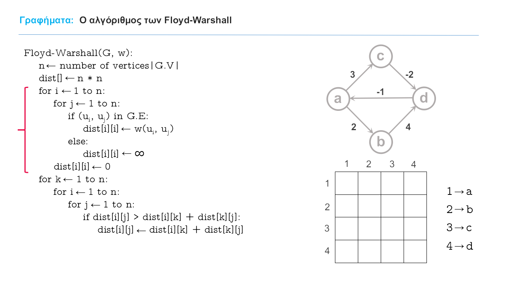
   
  
Στην συνέχεια ο αλγόριθμος θα συμπληρώσει κάθε στοιχείο του πίνακα γειτνίασης με το βάρος μιας ακμής. Κάθε κελί του πίνακα αντιστοιχεί σε μία ξεχωριστή ακμή. Για παράδειγμα το κελί <strong><em>(4, 3)</em></strong> αντιστοιχεί στην ακμή που συνδέει τον κόμβο <strong><em>d</em></strong> με τον κόμβο <strong><em>c</em></strong> και αντίστοιχα το κελί <strong><em>(3, 4)</em></strong> στην ακμή που συνδέει τον κόμβο <strong><em>c</em></strong> με τον <strong><em>d</em></strong>, κοκ.

  

  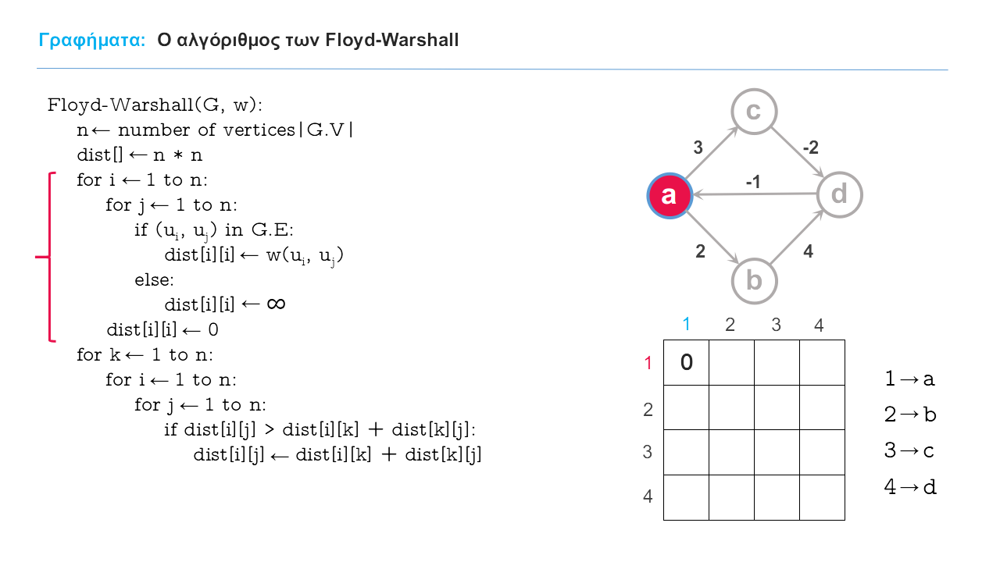
   
  
Ξεκινάμε από το πρώτο κελί του πίνακα <strong><em>(1, 1)</em></strong> που αντιστοιχεί στην ακμή που συνδέει τον κόμβο <strong><em>a</em></strong> με τον εαυτό του. Παρατηρούμε ότι για να πάμε από τον κόμβο <strong><em>a</em></strong> στον εαυτό δεν απαιτείτε κάποιο κόστος οπότε το στοιχείο αυτό του πίνακα θα ισούται με το μηδέν.

  

  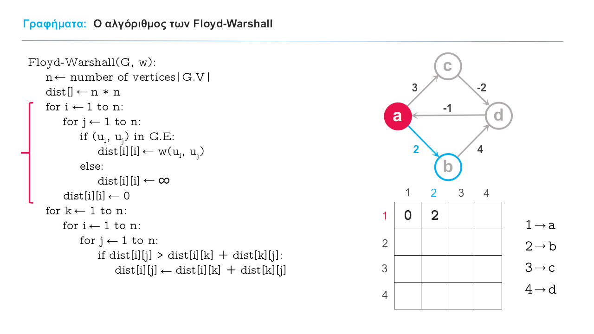
   
  
Στην επόμενη επανάληψη θα ελέγξουμε αν υπάρχει σύνδεση μεταξύ των κόμβων <strong><em>a</em></strong> και <strong><em>b</em></strong>. Παρατηρούμε στο γράφημα ότι υπάρχει τέτοια σύνδεση, άρα θέτουμε το στοιχείο στην θέση <strong><em>(1, 2)</em></strong> ίσο με το  βάρος της ακμής.

  

  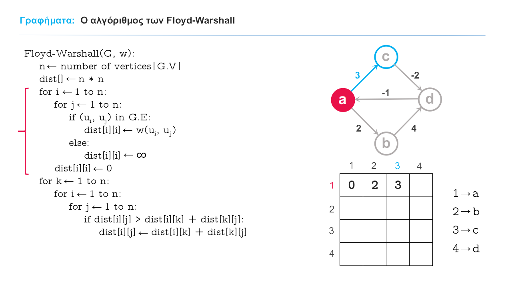
   
  
Το επόμενο κελί είναι το <strong><em>(1, 3)</em></strong>, άρα θα εξετάσουμε αν υπάρχει σύνδεση μεταξύ των κόμβων <strong><em>a</em></strong> και <strong><em>c</em></strong>. Παρατηρούμε ότι υπάρχει άρα προσθέτουμε το βάρος της ακμής που συνδέει τους κόμβους <strong><em>a</em></strong> και <strong><em>c</em></strong> στον πίνακα.

  

  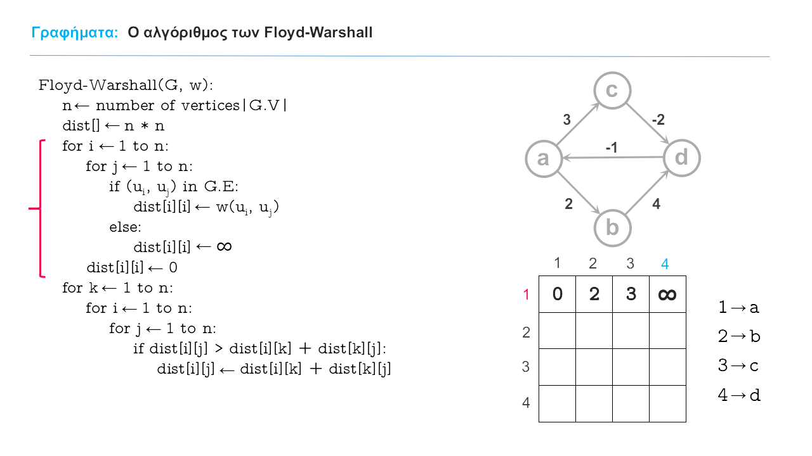
   
  
Τέλος παρατηρούμε ότι ο κόμβος <strong><em>a</em></strong> δεν συνδέεται με τον κόμβο <strong><em>d</em></strong>. Η τιμή που θα προσθέσουμε στον πίνακά μας θα είναι ίση με το άπειρο.

  

  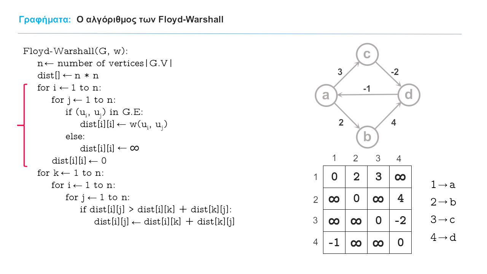
   
  
Αν συνεχίσουμε την ίδια διαδικασία για κάθε στοιχείο του πίνακα, θα τον έχουμε συμπληρώσει με τις τιμές που παρατηρούμε στην οθόνη μας.

  

  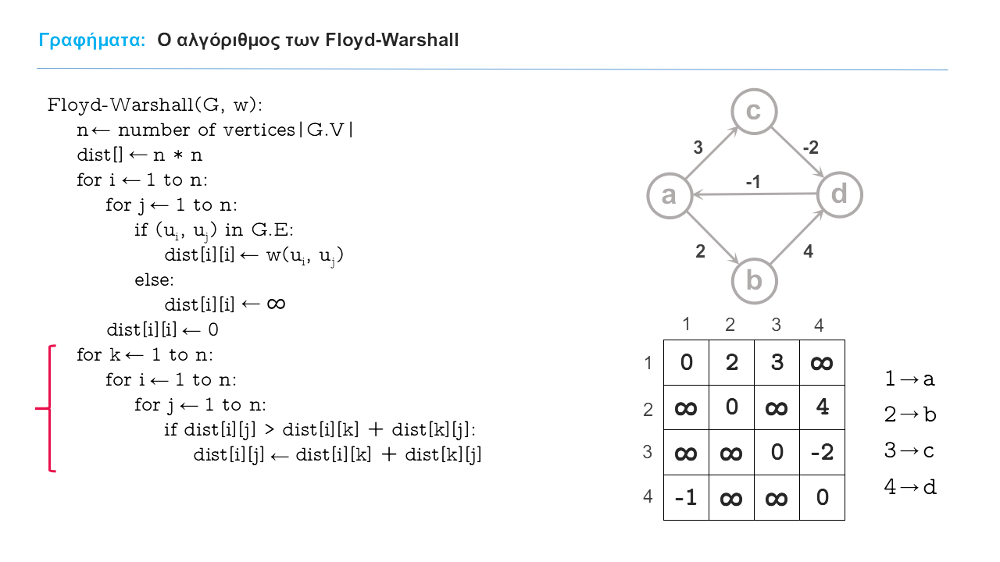
   
  
Μετά την ολοκλήρωση της αρχικοποίησης του πίνακα, μπορούμε να τρέξουμε το κύριο σώμα του αλγορίθμου. Μετά την εκτέλεση αυτών των γραμμών θα γνωρίζουμε τις ελάχιστες αποστάσεις μεταξύ όλων των κόμβων του γραφήματος μας.

  

  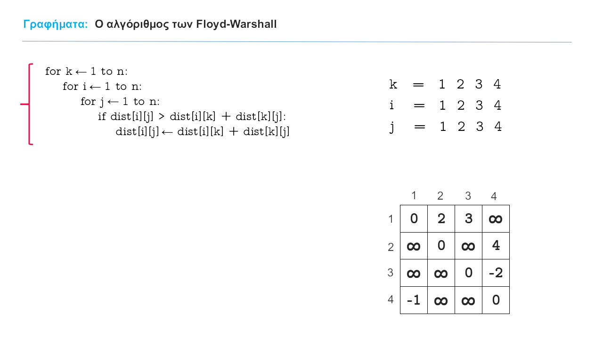
   
  
Σε αυτό το σημείο θα επικεντρωθούμε μόνο στον μισό ψευδοκώδικα, αφού έχουμε αποτυπώσει το γράφημά μας στον πίνακα γειτνίασης. Βλέπουμε στον κώδικα ότι έχουμε τρεις εμφωλευμένους βρόγχους ο καθένας με την δική του μεταβλητή.

  

  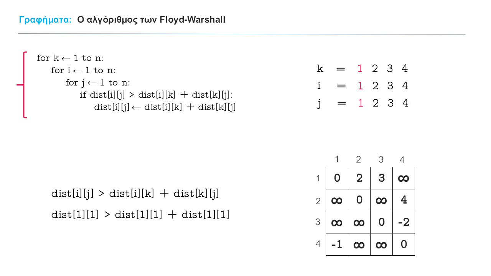
   
  
Στην πρώτη επανάληψη όλες οι μεταβλητές θα έχουνε την τιμή 1. Ο αλγόριθμος θα ελέγξει την συνθήκη που βρίσκεται στο σώμα του τελευταίου βρόγχου αντικαθιστώντας τους δείκτες του πίνακα με κάθε μία μεταβλητή.

  

  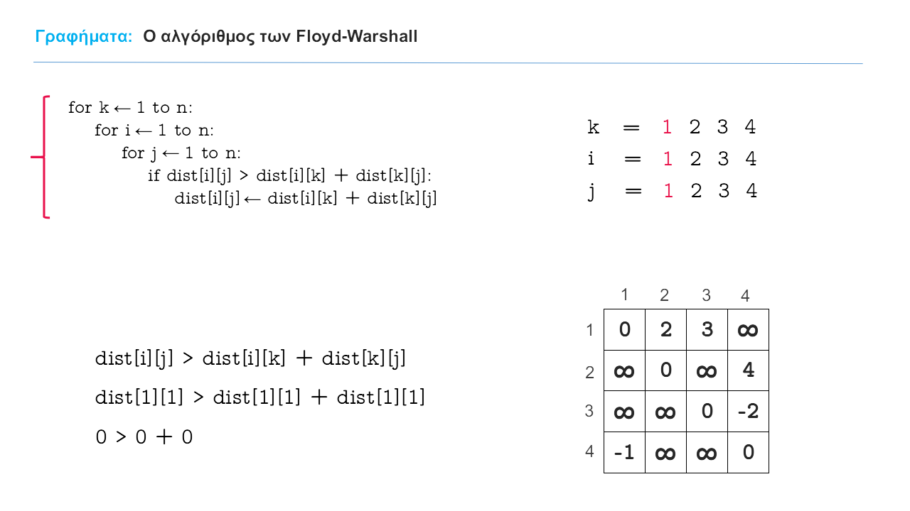
   
  
Παρατηρούμε ότι η το 0 δεν είναι μεγαλύτερο από το 0.

  

  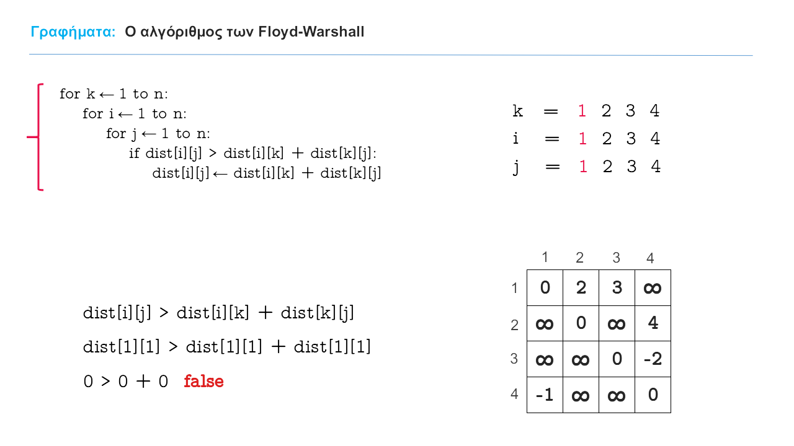
   
  
Η συνθήκη αποτιμάτε ως ψευδής και ακολουθεί η επόμενη επανάληψη.

  

  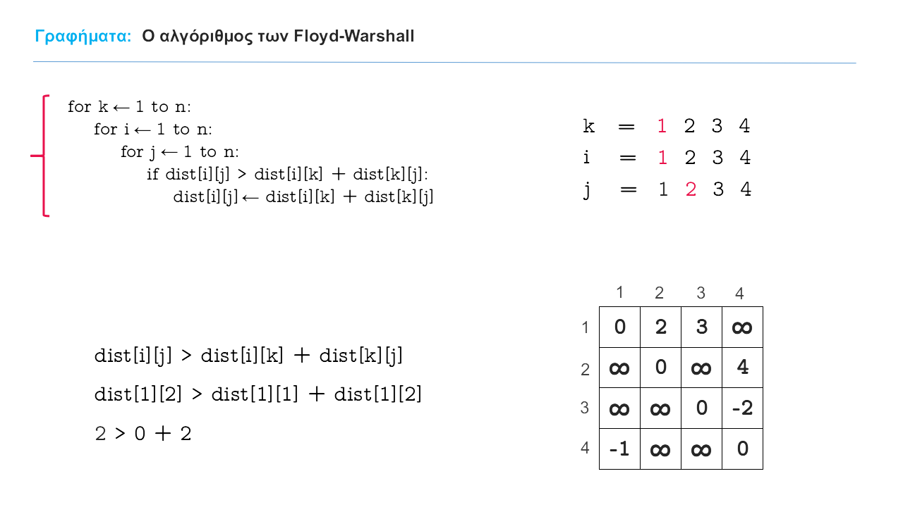
   
  
Για <strong><em>k = 1</em></strong>, <strong><em>i = 1</em></strong> και <strong><em>j = 2</em></strong> η συνθήκη και πάλι αποτιμάτε ως ψευδής.

  

  
   
  
Η διαδικασία που ακολουθούμε είναι απλή αλλά επίπονη. Θα χρειαστεί να ελέγξουμε την συνθήκη για όλες τις τιμές <strong><em>k</em></strong>, <strong><em>i</em></strong>, <strong><em>j</em></strong>. Συνολικά θα εκτελέσουμε  64 τέτοιους ελέγχους. Για να μην κουραστούμε ας δούμε μια πιο ενδιαφέρουσα επανάληψη.

  

  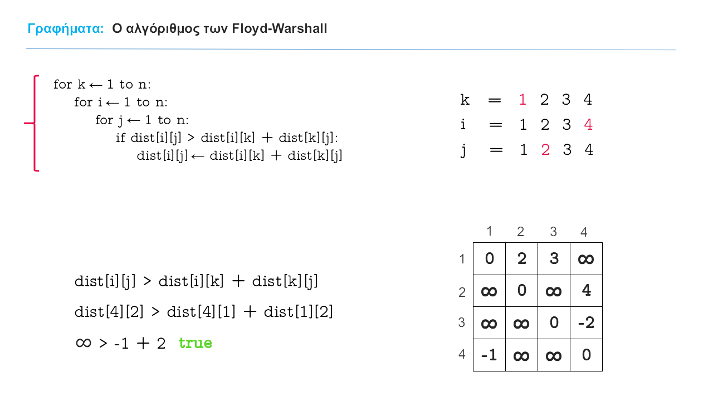
   
  
Για τις τιμές <strong><em>k = 1</em></strong>, <strong><em>i = 4</em></strong> και <strong><em>j = 2</em></strong> η συνθήκη μέσα στο σώμα του βρόγχου αποτιμάτε για πρώτη φορά ως αληθής.

  

  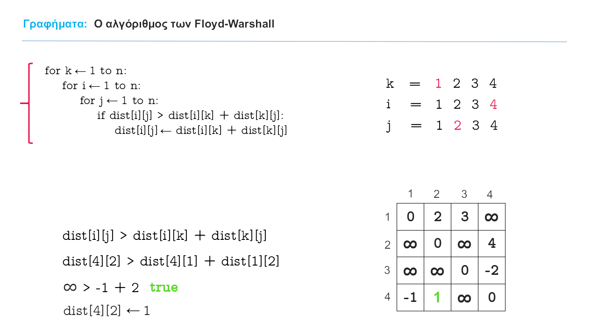
   
  
Οπότε μπορούμε να ανανεώσουμε το στοιχείο που βρίσκεται στην θέση <strong><em>(4, 2)</em></strong> στο πίνακα γειτνίασης με την νέα του τιμή.

  

  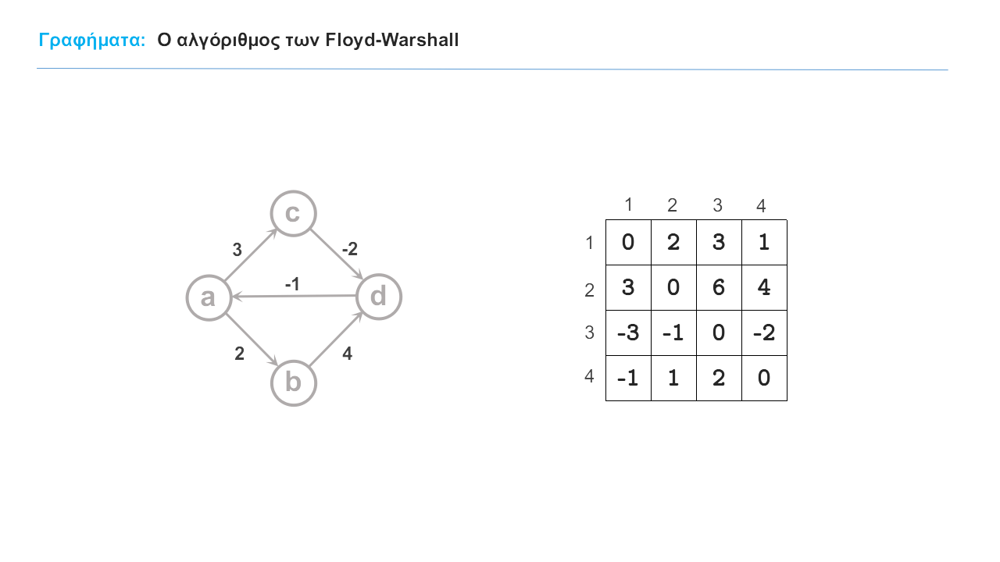
   
  
Μετά την εκτέλεση του αλγορίθμου προκύπτει ο νέος πίνακας με τις ελάχιστες αποστάσεις μεταξύ των κόμβων του γραφήματος μας.

  

  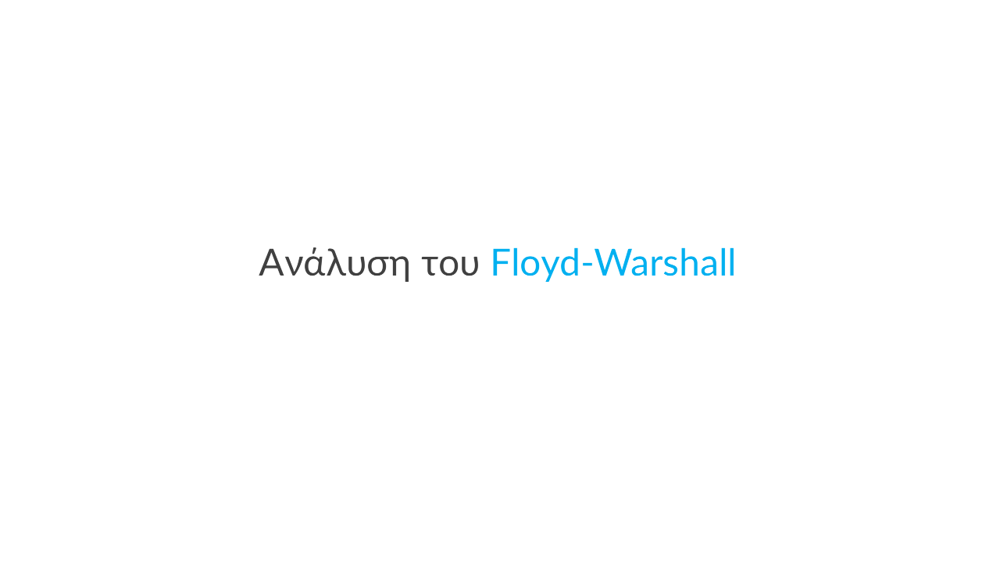
   
  

  

  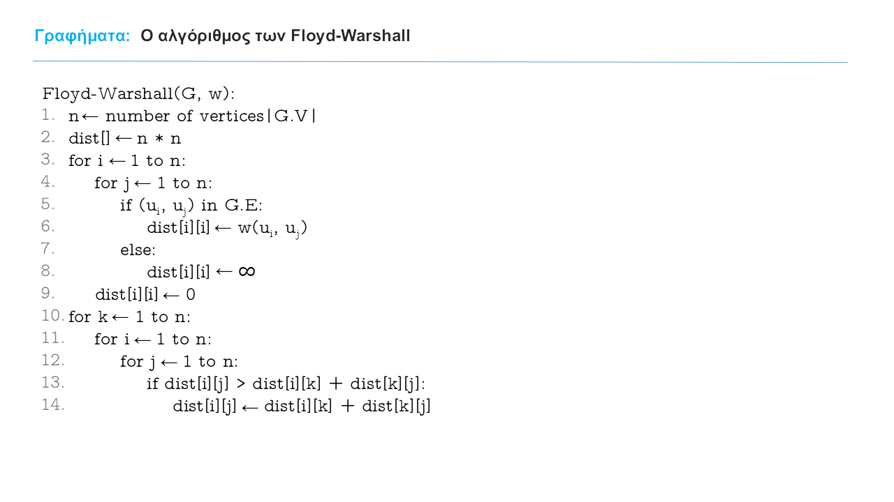
   
  

  

  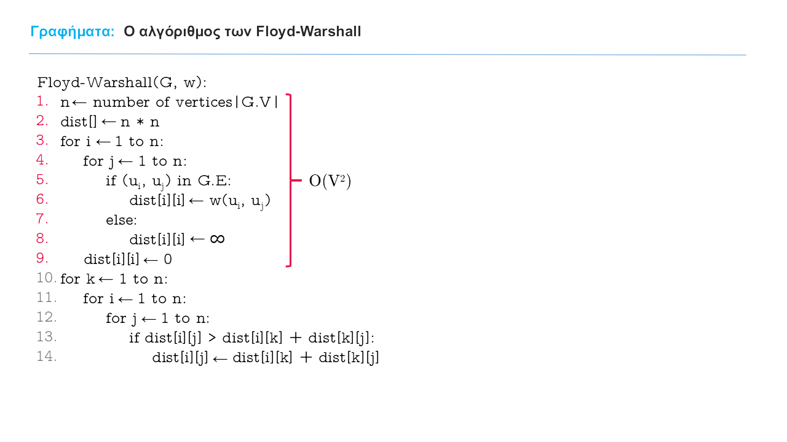
   
  
Οι γραμμές 1 έως 9 θα εκτελεστούν συνολικά <strong><em>O(V^2)</em></strong> φορές. Οι γραμμές 1 και 2 εκτελούνται σε σταθερό χρόνο. Η  γραμμή 3 θα εκτελεστεί συνολικά <strong><em>O(V)</em></strong> φορές. Οι γραμμές 4 έως 8 θα εκτελεστούν συνολικά <strong><em>O(V^2)</em></strong> φορές και η γραμμή 9 <strong><em>O(V)</em></strong> φορές.

  

  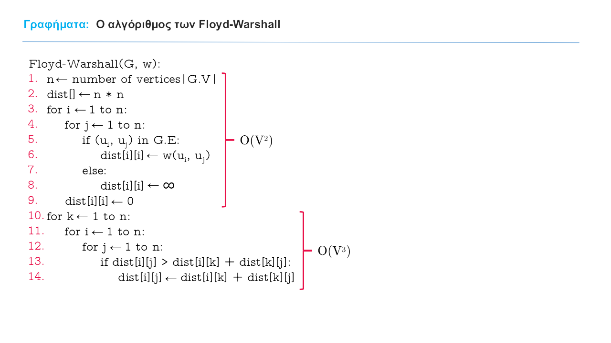
   
  
Οι γραμμές 10 έως 14 θα εκτελεστούν συνολικά <strong><em>O(V^3)</em></strong> φορές.

  

  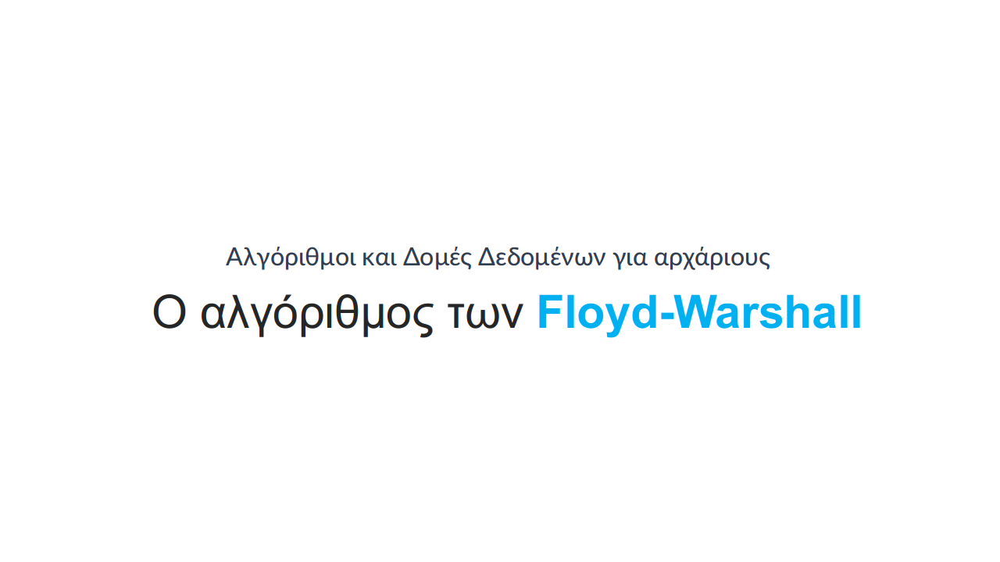
   

